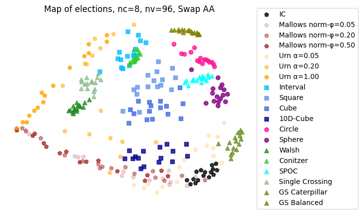

This is an exemplar map of elections with 8 candidates and 96 voters which requires computing 46056
distances that was generated using the AA heuristic in about 1 minute on Intel Core i9-12900K CPU
utilizing all 16 cores. The reproducible code is in [minimap.py](/tests/minimap.py) file.
 
