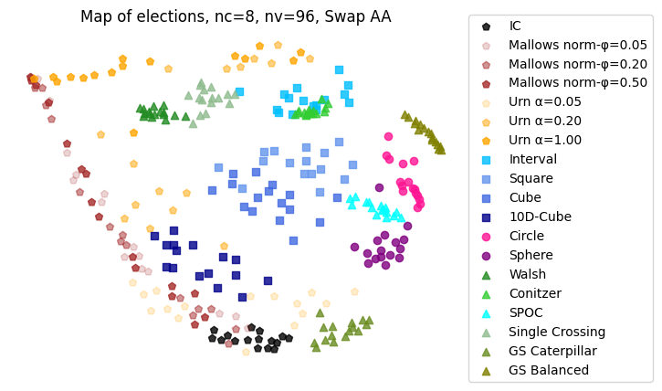
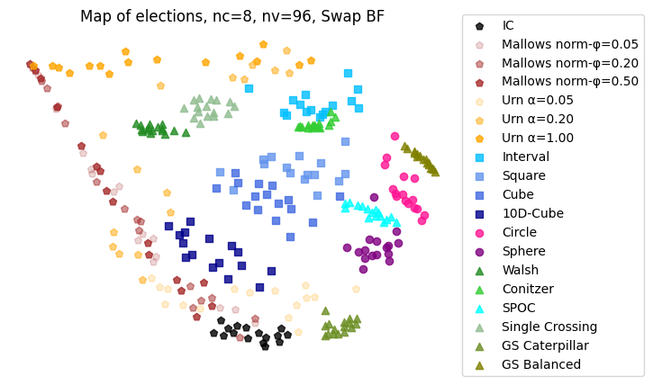

This is an exemplar map of elections with 8 candidates and 96 voters which requires computing 46056
distances that was generated using the AA heuristic in about 1 minute on Intel Core i9-12900K CPU or
about 7 minutes on Apple M1

*Exemplar Map of elections using fastmap AA heuristic | Time: ~1min (i9-12900K)*

Changing AA to BF method in fastmap library results (for the same list of elections) in computing time
of about 2h on Intel Core i9-12900K CPU and generates the following map.

*Exemplar Map of elections using fastmap BF | Time: ~2h (i9-12900K)*

The reproducible code is in [minimap.py](/tests/minimap.py) file. 

NOTE: there is some problem with `seed` parameter for `"norm-mallows"` culture in Mapel library
which makes setting seed not enough to get full reproducibility. To overcome this problem we save
the `args` list to `args.pickle` file and provide it to allow full reproducibility.
 